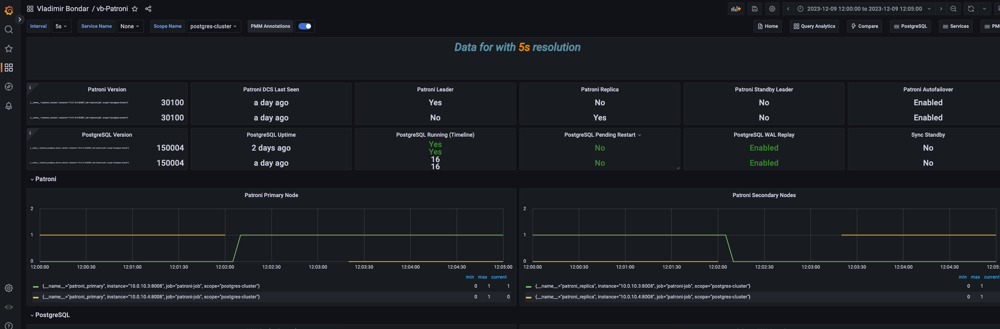
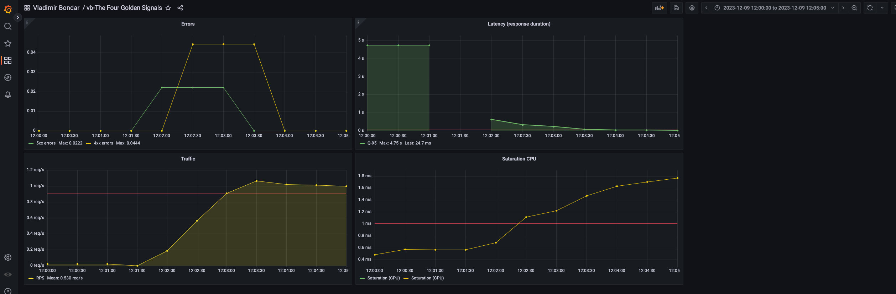
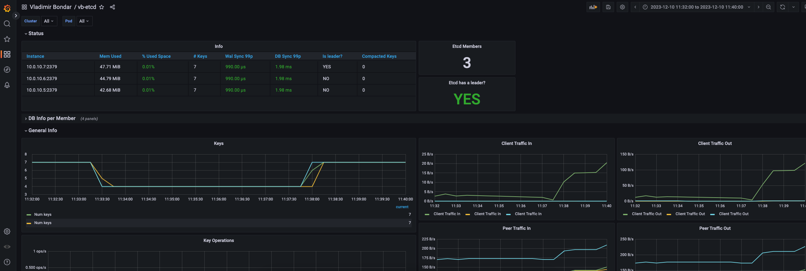
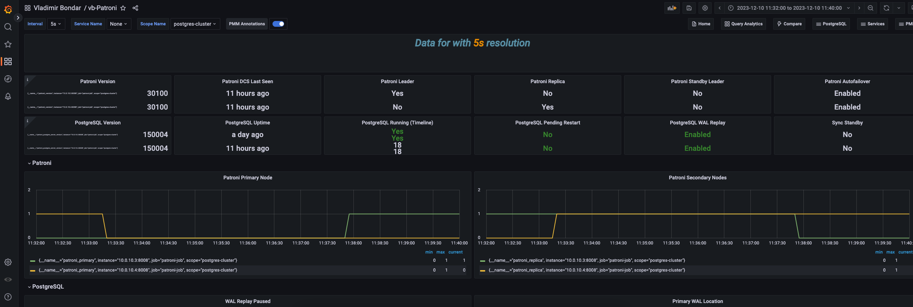
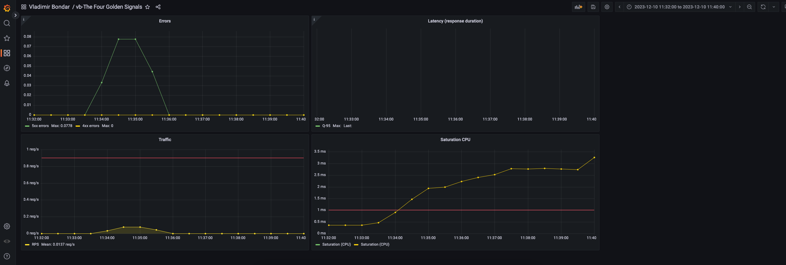
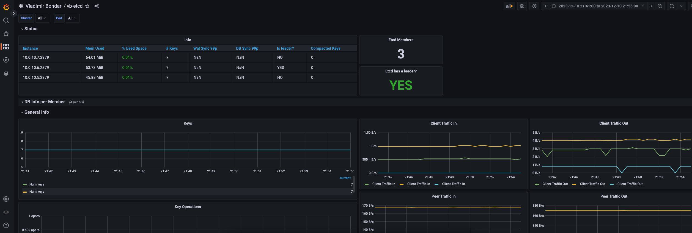
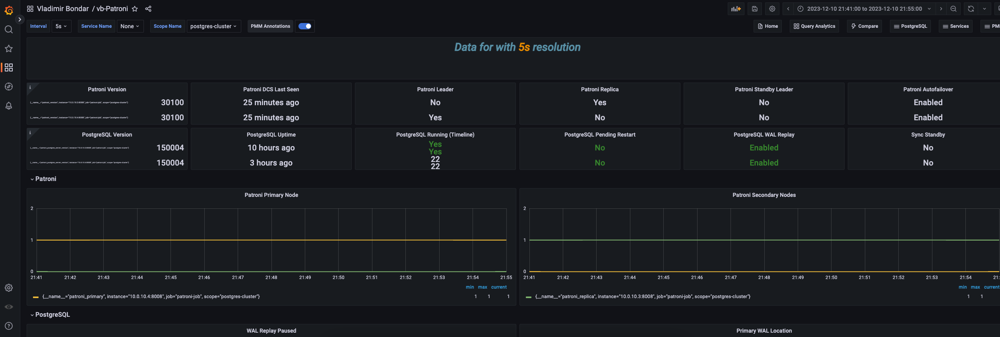
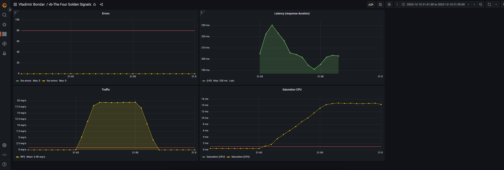
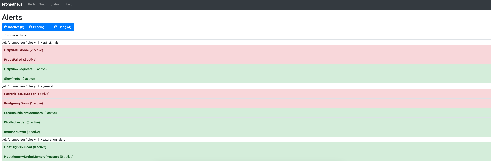

# Домашнее задание №4
**Задача:**

1. Отключение узла: Планово остановить один из узлов кластера, чтобы проверить процедуру
переключения ролей (failover). - Анализировать время, необходимое для восстановления и как
система выбирает новый Master узел (и есть ли вообще там стратегия выбора?).
2. Имитация частичной потери сети: Использовать инструменты для имитации потери пакетов
или разрыва TCP-соединений между узлами. Цель — проверить, насколько хорошо система
справляется с временной недоступностью узлов и как быстро восстанавливается репликация.
3. Высокая нагрузка на CPU или I/O: Запустить процессы, которые создают высокую нагрузку на CPU или дисковую подсистему одного из узлов кластера, чтобы проверить, как это влияет на
производительность кластера в целом и на работу Patroni.
4. Тестирование систем мониторинга и оповещения: С помощью chaos engineering можно также
проверить, насколько эффективны системы мониторинга и оповещения. Например, можно
искусственно вызвать отказ, который должен быть зарегистрирован системой мониторинга, и
убедиться, что оповещения доставляются вовремя ?

**Тестовая система:**

 
  Описание SRE Course API и реализации тестовой конфигурации
  

> SRE course weather API обеспечивает доступ к БД "weather" с таблицами "cities" и "forecast".
> 
> Доступные запросы:
> 
> - Cities: GET /Cities/{id}; PUT /Cities/{id}; POST /Cities; GET /Cities
> - Forecast: GET /Forecast/{id}; PUT /Forecast/{id}; POST /Forecast/{cityId}; GET /Forecast
> - WeatherForecast: GET /WeatherForecast

 
  Наполнение тестовой базы API 
  

> **Table Cities:** 170 записей. Список  городов России с населением более 100 тыс.
> **Table Forecast:** 1190 записей. Список записей о прогноза погоды на 7 дней для каждого города.

Компоненты системы

> - Ingress Controller (3 pods)
> - HAProxy (1 VM)
>   - 91.185.84.176 10.0.10.2
> - PosgreSQL, patroni (2 VMs)
>   - 10.0.10.3
>   - 10.0.10.4
> - etcd (3 VMs)
>   - 10.0.10.5
>   - 10.0.10.6
>   - 10.0.10.7
 
------------

##Эксперимент 1. Отключение узла
1. Описание:
    - определить nmaster узел PostgreSQL.
    - отключить VM c мастером в консоли CloudMTS
    - отследить состояние узлов в дашборде Grafana-Patroni
    - включить отключенный узел PostgreSQL
2. Ожидаемый результат:
    - рабочий узел становится мастером
    - система восстанавливает работоспособность
3. Реальный результат:
    - переключение узла прошло в соответствии с ожиданием
    - новый master выбран менее чем за 10 секунд
    - работоспостобность сервиса восстановлена
    
    
4. Анализ результатов: Эксперимент прошел без отклонений от ожидаемого результата

##Эксперимент 2. Имитация частичной потери сети
1. Описание:
    - отключить связь всех узлов patroni c серверами etcd
        - использовать chaosblade
        - sudo blade create network drop --destination-ip 10.0.10.5,10.0.10.6,10.0.10.7  --timeout 300
    - отследить поведение узлов PostgreSQL/patroni в дашборде Grafana-Patroni
    - проверить доступность системы во время эксперимента
2. Ожидаемый результат:
    - отключение etcd приведет к тому, что patroni потеряет возможность контроля и состояние системы не изменится
    - система сохранит работоспособностю
3. Реальный результат:
    - недоступность etcd привела к тому, что оба узла patroniполучили статус secondary
    - сервис недоступен. error 5xx
    - после восстановления связи с etcd patroni выбрал primary node
    - patroni leader сменился
    - работоспостобность сервиса восстановлена
    
    
    
4. Анализ результатов: выяснилась особенность работы patroni: без доступа etcd система теряет работоспособность. Мне кажется, что более приемлемым решением было бы сохранение статуса БД и patroni на время недоступности etcd. В таком случае временной проблемы с доступностью система могла сохранять работоспособность. Необходимо проверить, можно ли добится такого результата настроками patroni.

##Эксперимент 3. Высокая нагрузка на CPU
1. Описание:
    - нагрузить CPU на всех VM системы с использованием chaosblade
        - blade create cpu fullload --timeout 600
    - проверить работоспособность системы
        - с использованием jmeter с нагрузкой 20 RPS
        - при подготовке к эксперименту установлени, то нагрузка 30 RPS нагружает систему и приводит к появлению ошибок
        - нагрузка 20 RPS выдерживается системой без возникновения ошибок
    - отследить состояние узлов в дашборде Grafana-Patroni
2. Ожидаемый результат:
    - система продолжает работу
    - возможно с увеличением количества ошибок
3. Реальный результат:
    - система во время проведения эксперимента сохранила работоспособность и производительнось
        - jmeter:
            > Starting standalone test @ 2023 Dec 10 21:44:53 MSK (1702233893914)
            > Waiting for possible Shutdown/StopTestNow/HeapDump/ThreadDump message on port 4445
            > summary =   6073 in 00:05:47 =   17.5/s Avg:   163 Min:   107 Max:   958 Err:     0 (0.00%)
    
    
    
4. Система ожидаемо сохраняет работоспособность. в ДЗ-3 выяснилось, что узким местом системыы является кластер Ingress. Данный эксперимент подтвердил, что даже в случае увеличения нагрузки на виртуальные машины запас производительности по сравнению с компонентом Ingress.

##Эксперимент 4. Тестирование систем мониторинга и оповещения
1. Описание:
    - условия эксперимента повторяю условия эксперимента 2, а именно
    - отключить связь всех узлов patroni c серверами etcd
        - использовать chaosblade
        - sudo blade create network drop --destination-ip 10.0.10.5,10.0.10.6,10.0.10.7  --timeout 300
    - отследить поведение Prometheus Alerting
2. Ожидаемый результат:
    - регистрация Alert - потерян лидер patroni
3. Реальный результат:
    - стабатывание Alert: "patroni has no leader"
    - стабатывание Alert: "postgreSQL down"
    
4. Анализ результатов: Prometheus Alerts сработал штатно. Подтвердилось предположение работе сервера Alerting. В соответствии с результатом эксперимента №2 сработал Alert по недоступности postgreSQL.
